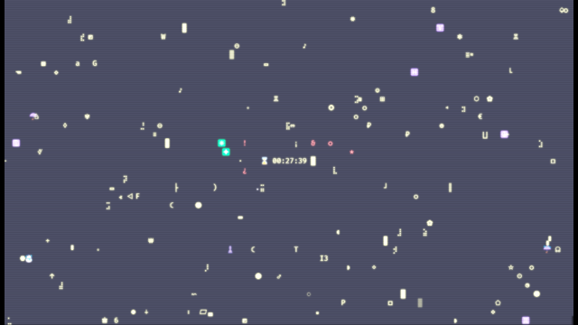

# CLI Countdown Timer

> *"If I was stranded on an island and the only way to get out is making a pretty UI... I would die there."*  
> — Linus Torvalds, creator of Linux  

This project is inspired by that philosophy — keeping things simple, powerful, and purely CLI-based.  

A mesmerizing terminal-based countdown timer inspired by the iconic **Matrix digital rain** effect.  
Watch time tick away as cascading symbols fall around your countdown display.

---

## 🎬 Demo


### Theme Gallery
| Matrix | Retro | Sci-Fi |
|--------|-------|--------|
|  |  |  |

| Urgent | Cyberpunk | Terminal |
|--------|-----------|----------|
|  |  |  |

---

## 🚀 Quick Start

### Installation
```bash
pip install wcwidth
# On Windows: pip install windows-curses
```

### Basic Usage
```bash
# Set timer to 10 PM
python testcase_1.py 22:00

# Set timer to 9:30 AM  
python testcase_1.py 09:30

# Set timer with retro amber theme
python testcase_1.py 15:45 retro
```

---

## 🖥️ Terminal Setup for the Full Experience

For the most authentic and visually rich Matrix experience, configure your terminal before running the script:

### 1. **Install a Nerd Font**
- Download [Fira Code Nerd Font](https://www.nerdfonts.com/) for the best symbol support
- Install the font on your system

### 2. **Set Your Terminal Font**
- Open terminal settings/preferences
- Change font to the Nerd Font you installed (e.g., `FiraCode Nerd Font`)

### 3. **Apply Color Scheme**
- Install [Dracula Theme](https://draculatheme.com/) for your terminal
- Gives you the perfect dark background for Matrix effects

### 4. **Enable Retro Effects (Optional)**
- Look for "Retro" or "CRT" effects in terminal appearance settings
- Adds authentic scanlines and glow effects

### Platform Recommendations
- **Windows**: Windows Terminal with CRT effects
- **macOS**: iTerm2 with custom themes
- **Linux**: Alacritty or GNOME Terminal

---

## ✨ Features

- **🌧️ Matrix Rain**: Cascading symbols with particle effects
- **⚡ Dynamic Sparks**: Electric particles around countdown
- **📺 CRT Scanlines**: Moving scan beam for authentic retro feel
- **🎯 Smart Display**: Auto-adapts to your terminal's capabilities
- **🎨 6 Color Themes**: From classic Matrix to cyberpunk neon
- **📱 Responsive**: Works on any terminal size

---

## 🎨 Themes

Choose from 6 immersive color schemes:

| Theme Code | Description | Vibe |
|------------|-------------|------|
| `matrix` | 🟢 Classic green Matrix | Iconic digital rain |
| `retro` | 🟠 Warm amber CRT | Nostalgic terminal feel |
| `scifi` | 🔵 Cool cyan/blue | Futuristic atmosphere |
| `urgent` | 🔴 Aggressive red | Deadline pressure |
| `cyberpunk` | 🟣 Purple/magenta neon | Underground hacker |
| `terminal` | ⚪ Clean white/green | Classic computing |

```bash
python testcase_1.py 22:00 [theme]
```

---

## 🛠️ Requirements

- Python 3.6+
- wcwidth package
- windows-curses (Windows only)

---

## 🤝 Contributing

Want to add more themes, effects, or features? Contributions welcome!

---

## 📄 License

MIT License - use freely!